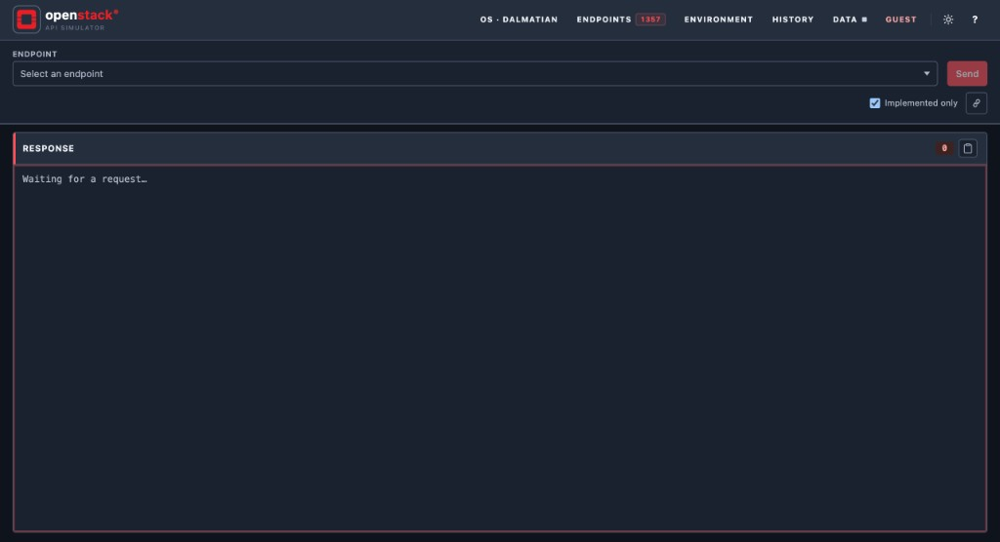

**Language / Язык:** [English](README.md) | [Русский](README.ru.md)

# openstack-api-simulator

Лабораторный stateful-симулятор OpenStack API: аутентификация Keystone, multi-port
шлюз на стандартных портах OpenStack, специализированные обработчики
Nova/Neutron/Glance/Cinder/Heat/Swift/Ironic/Octavia и schema-complete покрытие
остальных сервисов каталога (Yoga → Dalmatian).



## Быстрый старт (Compose)

### Опубликованный образ (Docker Hub)

Клонируйте репозиторий (nginx-конфиг api-gateway и лабораторные TLS-файлы
монтируются из `./docker/`), затем скачайте и запустите опубликованный
runtime-образ — без локальной сборки приложения:

```bash
git clone https://github.com/inecs/openstack-api-simulator.git
cd openstack-api-simulator

docker compose -f docker-compose.release.yml up -d --wait
# или: make release-up

curl -sf http://127.0.0.1:5000/health/ready

# Опционально: полное синтетическое облако (~1000 серверов)
make release-seed PROFILE=demo
```

Образ: [`inecs/openstack-api-simulator`](https://hub.docker.com/r/inecs/openstack-api-simulator)
(публикация: `make release`, когда будете готовы).

### Development checkout

```bash
cp .env.example .env
docker compose up -d --build --wait

# Опционально: полное синтетическое облако (~1000 серверов)
make seed-demo

# Полный multi-service smoke
make smoke
```

- Консоль: [http://localhost:5000/](http://localhost:5000/)
- OpenAPI: [http://localhost:5000/docs](http://localhost:5000/docs)

Подробнее: [Быстрый старт](docs/ru/getting-started.md).

### Helm (Kubernetes + Ingress + Let's Encrypt)

```bash
helm upgrade --install os-sim ./helm/openstack-api-simulator \
  -n openstack-sim --create-namespace \
  -f ./helm/openstack-api-simulator/values-ingress-example.yaml \
  --set certManager.email=you@example.com \
  --set ingress.hosts[0].host=os-sim.example.com \
  --set ingress.tls[0].hosts[0]=os-sim.example.com \
  --set secret.ticketSigningKey="$(openssl rand -hex 32)" \
  --set postgresql.auth.password="$(openssl rand -hex 16)"
```

Подробности: **[Kubernetes / Helm](docs/ru/kubernetes.md)** · README чарта:
[`helm/openstack-api-simulator`](helm/openstack-api-simulator/README.ru.md).

Минимальный ClusterIP + port-forward:

```bash
helm upgrade --install os-sim ./helm/openstack-api-simulator \
  -n openstack-sim --create-namespace \
  --set secret.ticketSigningKey="$(openssl rand -hex 32)" \
  --set seed.enabled=true --set seed.profile=minimal

kubectl -n openstack-sim port-forward \
  svc/os-sim-openstack-api-simulator-gateway \
  5000:5000 8774:8774 9696:9696 9292:9292 8776:8776
```

### Учётные данные (seed)

**Minimal seed** (по умолчанию при старте):

| Пользователь | Пароль | Проект | Роль |
|---|---|---|---|
| `admin` | `secret` | `admin` / `demo` | admin |
| `demo` | `secret` | `demo` | member |

**Demo cloud** (Data drawer → *Load demo cloud* / `make seed-demo`): ~1000 серверов,
16 гипервизоров, 3 AZ, 5 проектов, сети/порты/FIP, 600 томов, LB, стеки,
Ironic, Swift.

| Пользователь | Пароль | Типичные проекты |
|---|---|---|
| `admin` | `secret` | все проекты |
| `ops` | `secret` | production, staging |
| `developer` | `secret` | development, staging |
| `demo` / `auditor` | `secret` | demo / production |

Домен: `Default`.

### Пример аутентификации

```bash
curl -i -X POST http://localhost:5000/v3/auth/tokens \
  -H 'Content-Type: application/json' \
  -d '{
    "auth": {
      "identity": {
        "methods": ["password"],
        "password": {
          "user": {
            "name": "demo",
            "domain": {"name": "Default"},
            "password": "secret"
          }
        }
      },
      "scope": {
        "project": {"name": "demo", "domain": {"name": "Default"}}
      }
    }
  }'
# Используйте X-Subject-Token как X-Auth-Token.

curl -sH "X-Auth-Token: $TOKEN" -H "OpenStack-API-Version: compute 2.79" \
  http://localhost:8774/v2.1/servers/detail
curl -sH "X-Auth-Token: $TOKEN" http://localhost:9696/v2.0/routers
```

## Документация

Документация двуязычная. Переключатель **Language / Язык** — в первой строке
каждой страницы; английский корень — [README.md](README.md). Оглавление:
[docs/README.md](docs/README.md) · [docs/ru/README.md](docs/ru/README.md).

| Руководство | Тема |
|---|---|
| [Быстрый старт](docs/ru/getting-started.md) | Первая лабораторная сессия (Compose) |
| [Kubernetes / Helm](docs/ru/kubernetes.md) | Установка в кластер, Ingress, cert-manager |
| [Конфигурация](docs/ru/configuration.md) | Переменные окружения, Compose, Helm |
| [Аутентификация](docs/ru/authentication.md) | Токены Keystone и seed-пользователи |
| [Порты](docs/ru/ports.md) | Реальные порты API OpenStack (публикация 1:1) |
| [API surface](docs/ru/api-surface.md) | Специализированные vs schema-пакеты |
| [Версии API](docs/ru/api-versions.md) | Серии Yoga → Dalmatian |
| [Покрытие API](docs/ru/api_coverage.md) | Счётчики операций |
| [Seed-профили](docs/ru/seed-profiles.md) | `minimal` / `demo` |
| [Клиенты](docs/ru/clients.md) | SDK / CLI |
| [Web UI](docs/ru/web-ui.md) | Консоль и drawers |
| [Эксплуатация](docs/ru/operations.md) | Day-2, релиз, reseed |
| [Архитектура](docs/ru/architecture.md) | Компоненты и путь запроса |
| [Безопасность](docs/ru/security.md) | Threat model лаборатории |
| [Наблюдаемость](docs/ru/observability.md) | Health и логи |
| [Устранение неполадок](docs/ru/troubleshooting.md) | Типичные сбои |
| [FAQ](docs/ru/faq.md) | Краткие ответы |
| [Домены](docs/ru/domains/README.md) | Заметки по сервисам |
| [Примеры](docs/ru/examples/overview.md) | Cookbook'и клиентов |
| [Hypervisor-lab](docs/ru/hypervisor-lab.md) | Pulumi-покрытие API (все ops × серии) |

## Лаборатория покрытия API (Pulumi)

Сьют в [`pulumi-tests/`](pulumi-tests/) максимально использует **`pulumi_openstack`**,
затем HTTP-probe pack-операций с проверкой **непустых** тел для **yoga → dalmatian**.

```bash
make pulumi-tests            # из корня репозитория
# или:
cd pulumi-tests && make test-pulumi-smoke && make test-pulumi
open pulumi-tests/reports/pulumi-report.html
```

Подробности: **[docs/ru/hypervisor-lab.md](docs/ru/hypervisor-lab.md)**.

Полная матрица **реальных портов OpenStack по умолчанию**, публикуемых 1:1
(Keystone `:5000`, Nova `:8774`, Neutron `:9696`, Glance `:9292`, Cinder `:8776`, …):
см. [docs/ru/ports.md](docs/ru/ports.md).

Nginx выставляет `X-OpenStack-Service` / `X-Forwarded-Port`. Приложение
переписывает путь в `/_os/<service>/…`, чтобы `/v3` (Keystone vs Cinder) и `/v1`
(Heat vs Swift) не конфликтовали.

## Реализованная поверхность API

Пакеты контрактов в `contracts/openstack/<series>/` дают **1300+ операций**
по **28 сервисам** (Yoga → Dalmatian). Schema-движок монтирует каждую операцию
пакета; специализированные роутеры сохраняют stateful happy-path'ы.

| Инструмент | Назначение |
|---|---|
| `PYTHONPATH=tools python3 tools/os_api_inventory/generate_packs.py` | Перегенерация series-пакетов |
| `python3 tools/os_api_inventory/coverage_report.py` | Запись [docs/api_coverage.md](docs/api_coverage.md) |
| `python3 examples/python/openstack_smoke.py` | Multi-port GET smoke |
| `python3 examples/python/openstack_surface_probe.py` | Полный lifecycle-probe |

**WebUI:** Environment → OpenStack API pack — активация серии и microversions.

Это **лабораторный surface-complete** симулятор (ответы в форме API-ref), а не
бит-в-бит идентичный upstream OpenStack.

Drawers консоли, параметры запроса и скриншоты: **[Web UI](docs/ru/web-ui.md)**.

## Лицензия

Apache-2.0 — см. [LICENSE](LICENSE).
