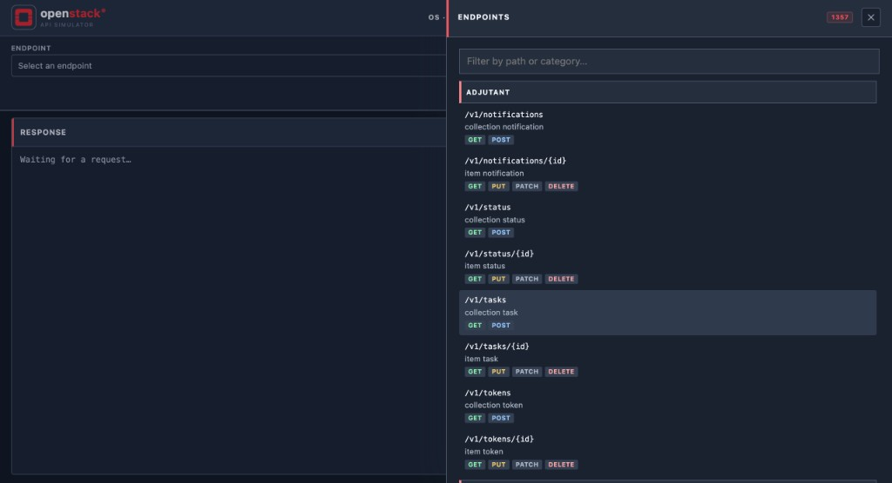
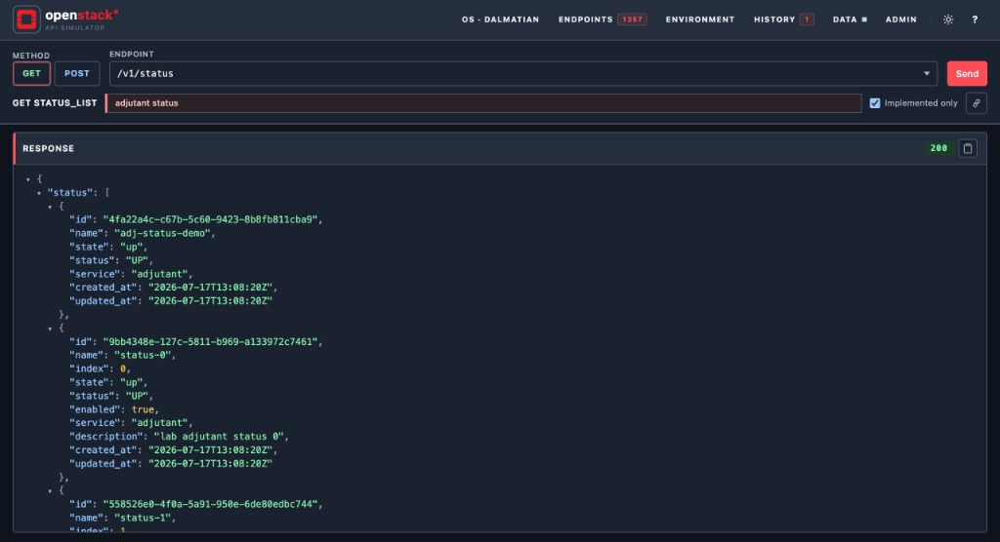
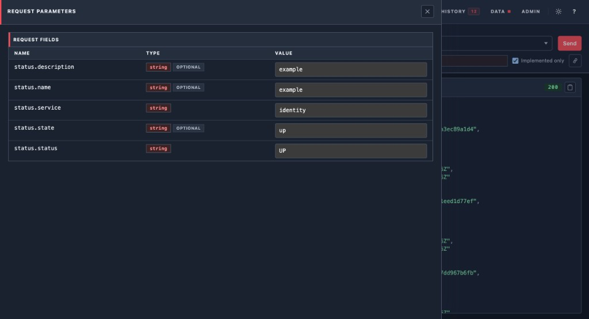
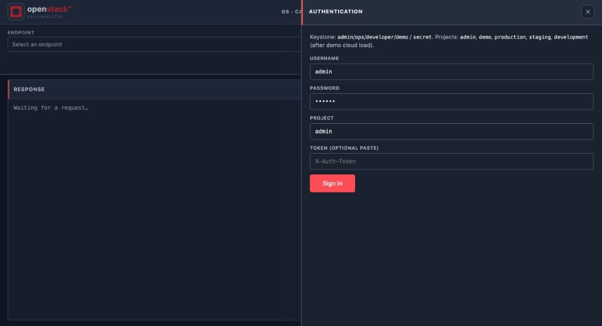
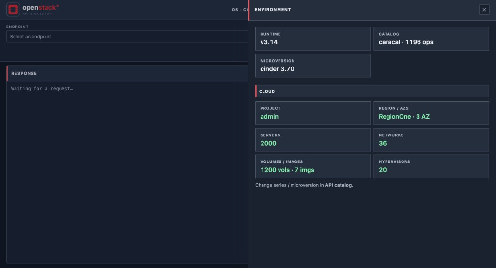
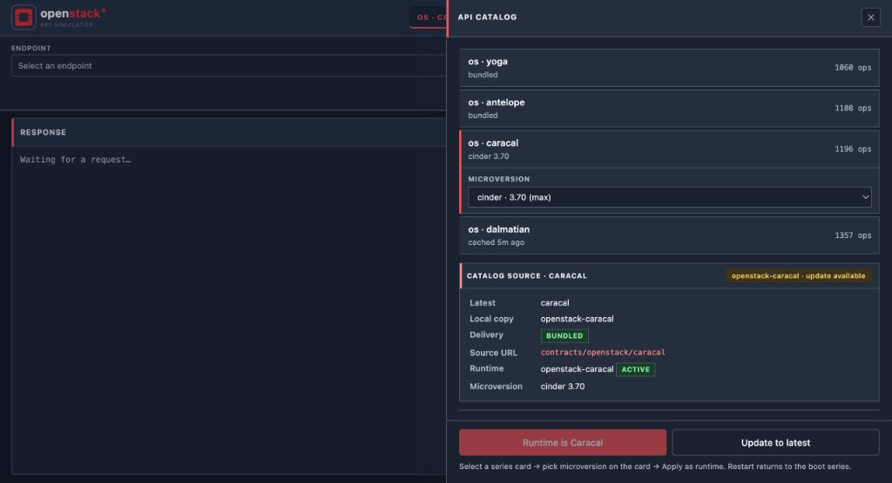
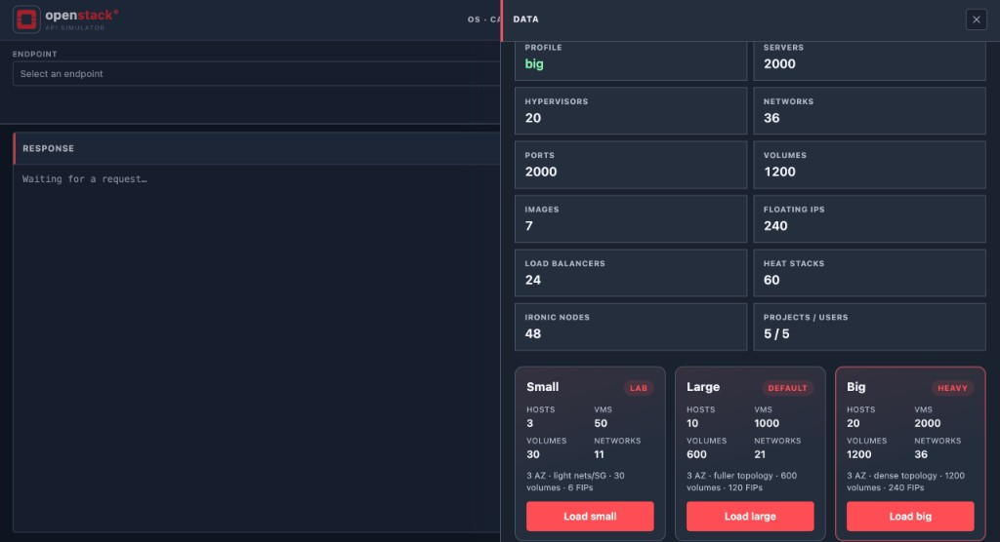
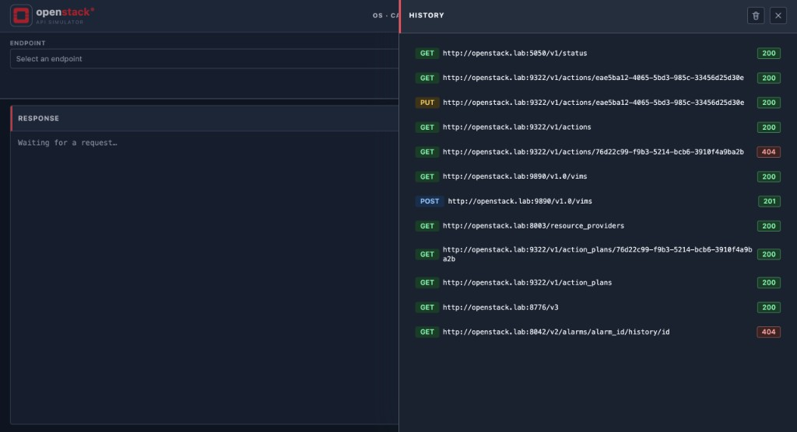
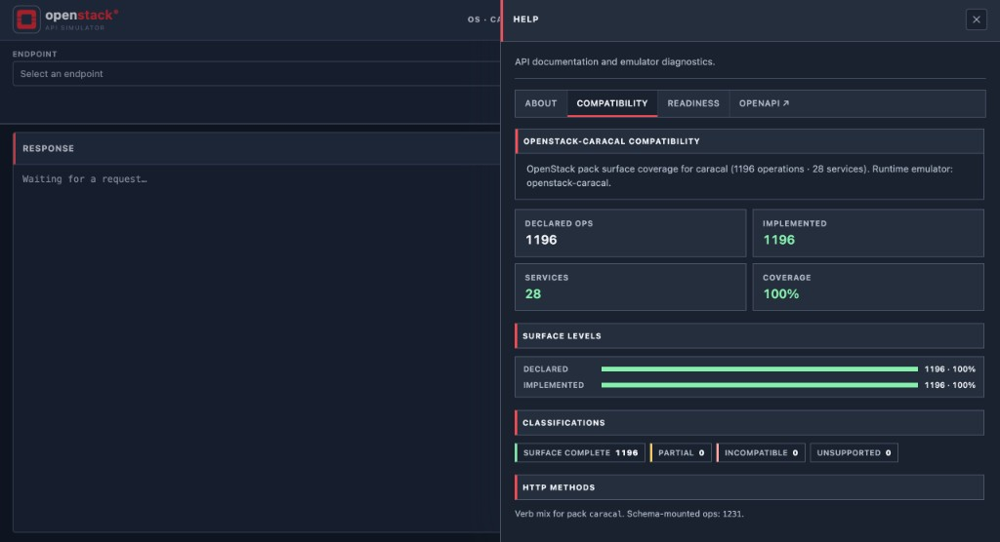

**Language / Язык:** [English](web-ui.md) | [Русский](ru/web-ui.md)

# Web UI

Console is served from the Keystone/UI port (**5000** on the gateway).

| URL | Purpose |
|---|---|
| `/` or `/console` | Interactive console |
| `/docs` | OpenAPI (simulator) |
| `/ui/api/…` | UI JSON APIs |

## Endpoints drawer

Browse the pack surface by service (for example Adjutant). Each path shows the
supported verbs.

## Sending requests

Pick a verb + path, then **Send**. Successful calls show status and JSON in
**RESPONSE**.

### Request parameters

For `POST` / `PUT` / `PATCH`, **Request parameters** lists schema fields
(dotted names for nested OpenStack envelopes) with types, optional flags, and
example values. The Request body JSON is built from those fields.

## Authentication drawer

Sign in with lab Keystone users (`admin` / `secret`, projects such as `admin`
or `demo`). Optional paste of an existing `X-Auth-Token`.

## Environment drawer

- Runtime / catalog / active **microversion**, plus live cloud inventory
  (servers, nets, volumes…)

## API catalog drawer

- Select an OpenStack series card (`os · yoga` …), choose a **microversion** on
  the card, then **Apply as runtime** (choice is remembered across reloads)

## Data drawer

- **Load demo cloud** — sized clusters (small / large / big)
- **Reset to minimal** — minimal lab seed

## History drawer

Recent console calls with method, URL, and status.

## Help · Compatibility

Pack surface coverage for the active series (declared / implemented ops,
services, verb mix).

## Branding

OpenStack red `#ED1C24`, console wordmark. Themes follow the shared console
chrome (light/dark).

## Health

- `/health/live` — process up
- `/health/ready` — migrations applied + DB reachable
